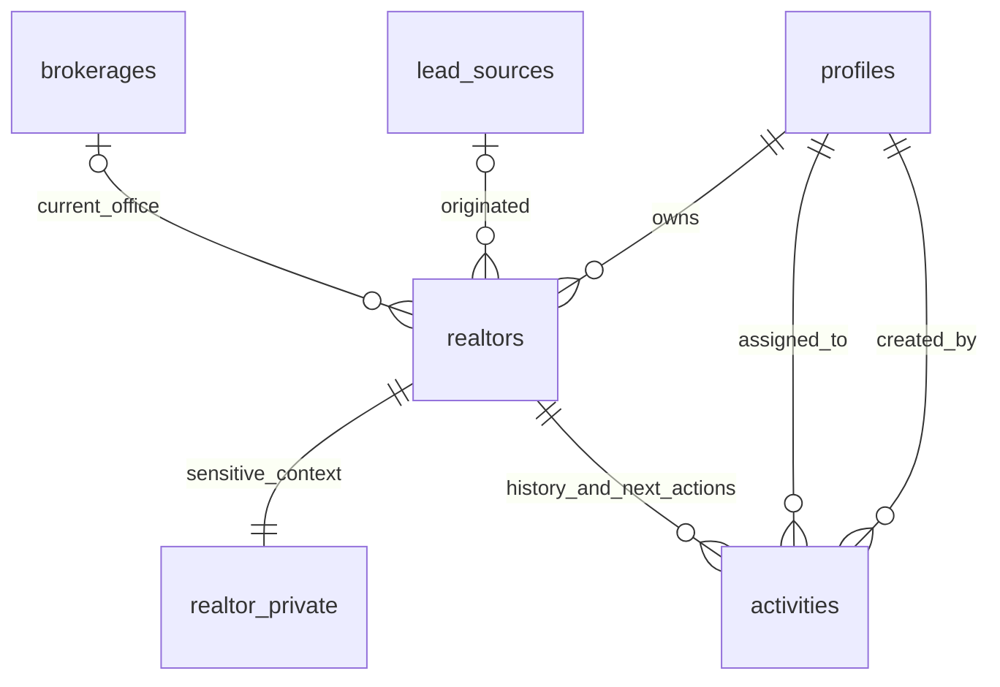

# Glara OS architecture — through M1

## Foundation retained

One private company application; no multi-tenancy or microservices. Next.js App Router Server Components fetch data, client components handle interaction. Request-scoped identity caching deduplicates reads without caching identities across users. Proxy refreshes sessions; the server independently calls Auth getUser and checks current profiles/roles. Metadata never grants permissions.

Module access is centralized in `src/lib/permissions.ts`. CRM operations add centralized write/manage helpers in `src/lib/crm/model.ts`. These improve UI and service behavior; PostgreSQL remains the independent data authorization boundary. Explicit M1 routes override the allowlisted placeholder route.

## M1 relational model

Tasks and follow-ups are activity types, not duplicate task tables. Activities share status, assignee, priority, due date, completion timestamp and notes. Communication is manually logged; completed calls/messages/meetings determine first/last contact. The earliest open due activity determines next follow-up and next-action title. These derived values are never independently editable.

Realtor notes, listing estimates, average listing price and manual scores live in a one-to-one private table so Marketing cannot obtain them through direct Supabase requests. Average listing price is numeric(16,2), interpreted as CAD. It is not revenue. Audits preserve historical brokerage/owner changes; dedicated effective-dated brokerage membership can be added later if needed.

All business tables use UUIDs, timestamps, foreign keys and appropriate soft deletion. The private companion follows its parent's archive visibility. No business hard-delete API is exposed.

## Invariants and concurrency

Realtor create/update and optional next action run inside one `crm_mutate` transaction. A deferred constraint enforces at least one open dated action for each active prospect. Activity mutations lock the parent Realtor row, serializing last-action completion against other activity/archive changes. A last-action completion may insert a replacement atomically. Dormant/historical relationships have no forced next action.

Realtor edits/archive/restore use an explicit version to reject stale saves. Completed activities cannot be completed again. Unique active normalized email/phone indexes reject duplicates; restoration also checks uniqueness. Names alone are not duplicate people, and records are never silently merged. Phone normalization strips punctuation; differing country-code conventions are not automatically merged.

## Data access and authorization

Presentation code calls `src/lib/crm/data.ts`, not scattered Supabase queries. Reads use a security-invoker `crm_query` and security-invoker view, respecting table RLS. Bounded security-definer helpers return only safe brokerage names/options and check active roles. Mutations have no dynamic SQL or client-selected table/column, explicitly map inputs, derive the actor from auth.uid, and check active operational ownership.

Every table has RLS. Anonymous access and direct authenticated DML are revoked. Operational writes go through narrowly scoped RPC cases. Owner/sales/admin are operational roles; only owner/admin recover archived Realtors or configure sources. Marketing receives the safe directory but no private fields, brokerage notes or activity history. Designer/crew, inactive identities and unassigned users are denied. Owner-only audit visibility is retained.

The service validates mutation input using Zod. RPC constraints and role checks also protect direct API callers. Browser permission checks never authorize data. Identity administration remains trusted SQL only.

## Bounded queries and indexes

Realtor lists use 25-row server pagination and total count; global results are capped at eight. Timelines and due queues return 30 rows. Brokerage lookup/list returns 25. Configurable source/active roster choices are capped at 500 each; a larger company would need paginated configuration pickers.

Name/email prefix search uses PostgreSQL full-text search with safely constructed tokens. Normalized phone substring lookup supports entered punctuation/country-code differences during search. City/area and office lookups are bounded substring searches, with no external search system. Very broad phone/area filters may scan rows; no 20,000-row performance benchmark is claimed.

Indexes cover active search, name, brokerage, owner/status, timeline event time, open due dates and assignee/due dates. Read queries use joins/aggregates in one request rather than per-row browser/server requests. Offset paging is capped at 800 pages (20,000 directory records); keyset paging can replace it if measured scale requires.

## Audit and operations

Existing audit triggers record all M1 inserts/updates/deletes transactionally: entity, UUID, action, old/new values, actor and timestamp. This covers notes/scores, assignment/status, archive/restore, activities, offices and sources. A create operation can produce multiple physical row audit entries; this is an audit trail, not a curated event feed. Trusted SQL without a JWT has a null actor and must be correlated with administrative logs.

No automation engine, outbound communications, AI, media workflow, opportunity pipeline, project/inventory or financial subsystem is introduced. Future activity associations should use proper foreign keys/join tables as those entities arrive. Product catalog and physical assets remain separate future concepts. Active opportunities and quote/commercial governance remain M2+ responsibilities.

## UI and testing

M0 palette, system fonts, layout and accessible Radix primitives are retained. Desktop uses tables and a two-column profile; mobile uses cards and places next actions/history first. Forms retain values on validation errors and show pending/success states. Dialogs, keyboard navigation, focus rings, semantic labels and touch targets remain available.

Production browser tests exercise real pages/server actions/Supabase SDK with isolated PGlite-backed RPCs. The test Auth service is only a contract double; hosted Auth/PostgREST, email delivery and deployment must still be accepted in a disposable real Supabase environment.
